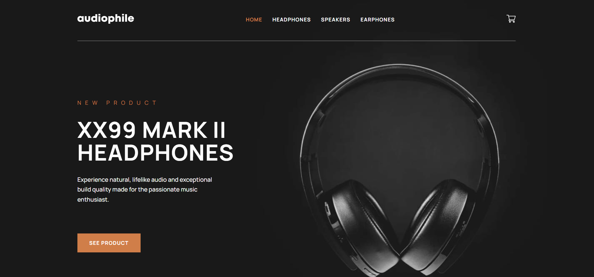
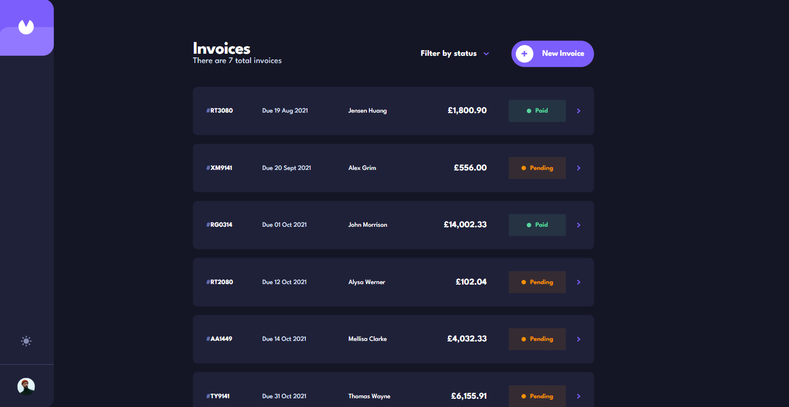

# Hello There 

My name is David, a aspiring web developer from the UK. I have a passion for learning new technologies and designing and building things with those technologies. I have a sharp eye for detail and always try and push myself that little bit further.

In my down time you'll find me chilling watching football, listening to music or cooking and eating spicy foods :hot_pepper:

- 🌱 I hope to start learning and using more technologies like wordpress and php in the future!
- 🔭 I’m currently working on improving my react skills by building a lot off different projects with it.
- 📫 If your interested in working together, get in touch here!

  

If your interested in checking out my porfolio just click here: https://www.djhwebdevelopment.com

### **Top technologies i use**

## Check out a couple of my projects

 

### **Audiophile E-Commerce** 

* Live Site: [Audiophile E-Commerce](https://audiophile-ecommerce-store.netlify.app/)
* gitHub: [Repo](https://github.com/David-Henery4/Audiophile-Ecommerce-site)

 

### **QK Invoices - Full-stack invoice creation app**

* Live Site: [QK Invoices](https://qk-invoices.netlify.app/login)
* gitHub: [Repo](https://github.com/David-Henery4/Invoice-app-Frontend)

 

### **Designo - Multi-Page Site**

* Live Site: [Designo](https://designo-customs.netlify.app)
* gitHub: [Repo](https://github.com/David-Henery4/Designo-Website)

 

### **Where in the world? - Country Information app**

* Live Site: [Where in the world?](https://where-abouts-in-the-world.netlify.app)
* gitHub: [Repo](https://github.com/David-Henery4/Where-in-the-world)

 

<!--
**DizzlyD/DizzlyD** is a ✨ _special_ ✨ repository because its `README.md` (this file) appears on your GitHub profile.

Here are some ideas to get you started:

- 🔭 I’m currently working on ...
- 🌱 I’m currently learning React and hope to start building my own projects with it soon!
- 👯 I’m looking to collaborate on ...
- 🤔 I’m looking for help with ...
- 💬 Ask me about ...
- 📫 How to reach me: ...
- 😄 Pronouns: ...
- ⚡ Fun fact: ...
-->
