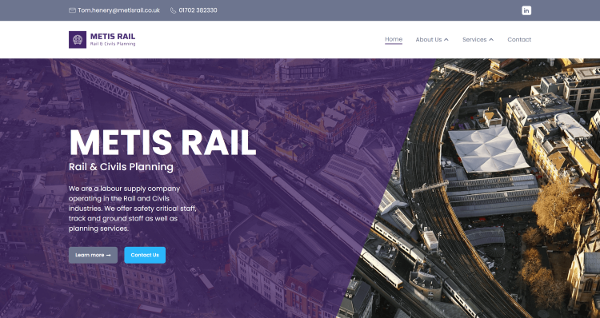
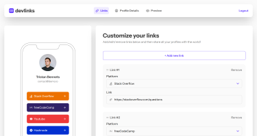
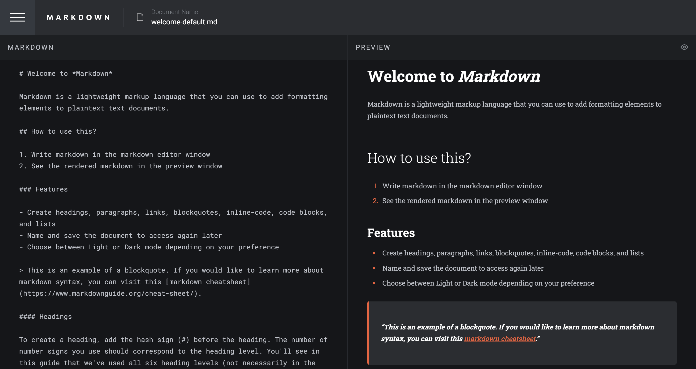

# Hello There 

 Hi, I'm David – a Full-Stack Developer from the UK

I'm passionate about designing and building modern web applications that are fast, accessible, and user-focused. I love learning new technologies and pushing myself to create cleaner, smarter, and more effective solutions with each project. I have a sharp eye for detail and enjoy refining both frontend and backend codebases to meet high standards.

When I’m not coding, you’ll probably find me watching football, vibing to music, or cooking something spicy 🌶️.

## 🚀 What I'm Working On

- 🔧 Honing my skills with **React**, **Next.js**, and **TailwindCSS** by building real-world projects.
- 🌱 Learning and integrating new technologies like **TypeScript**, **PHP**, **Laravel**, and **WordPress**.
- 🧠 Exploring backend development more deeply — working with **MongoDB**, **MySQL**, and full-stack app architecture.

## 🤝 Let’s Connect

I’m always open to collaborating on interesting projects or just chatting about tech.

- 🖥️ Check out my [Portfolio](https://www.djhwebdevelopment.com/)  
- 💻 Explore my [GitHub Projects](https://github.com/David-Henery4?tab=repositories)  
- 📫 Reach out on [LinkedIn](https://www.linkedin.com/in/david-henery-725458241/)

let’s build something great together!

 

### **Top technologies I use**

## Check out a couple of my projects

 

### **Metis Rail Website** 

* Live Site: [metis-rail.co.uk](https://www.metis-rail.co.uk/)

 

 

### **DevLinks – Full-Stack Link Sharing Platform for Developers** 

* Live Site: [DevLinks](https://link-share-app-beta.vercel.app/)
* Repo: [GitHub](https://github.com/David-Henery4/Link-Share-App)

 

 

### **Markdown Generator** 

* Live Site: [Markdown Generator](https://markdown-editor-md.vercel.app/)
* GitHub: [Repo](https://github.com/David-Henery4/Markdown-Editor)

 

<!--
**DizzlyD/DizzlyD** is a ✨ _special_ ✨ repository because its `README.md` (this file) appears on your GitHub profile.

Here are some ideas to get you started:

- 🔭 I’m currently working on ...
- 🌱 I’m currently learning React and hope to start building my own projects with it soon!
- 👯 I’m looking to collaborate on ...
- 🤔 I’m looking for help with ...
- 💬 Ask me about ...
- 📫 How to reach me: ...
- 😄 Pronouns: ...
- ⚡ Fun fact: ...
-->
